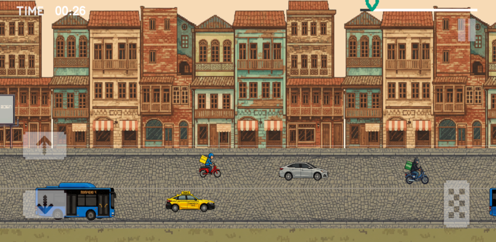
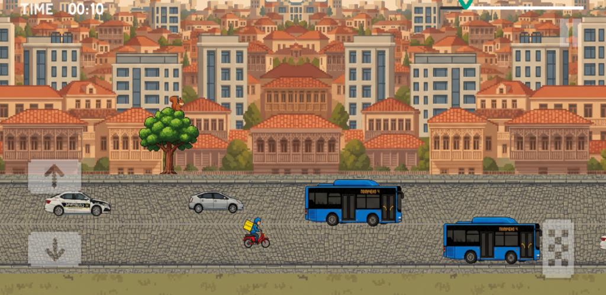

# 🛵 SHLOVO — Become Tbilisi's Ultimate Delivery Courier!

Jump on your motorcycle and hit the streets of Tbilisi!  
You are a courier with one mission — **deliver every order on time**.  

But as simple as it sounds, things quickly get out of hand as you progress through the city's wildest neighborhoods.

---

## 🎮 Gameplay Overview

SHLOVO is a fast-paced 2D arcade courier game where your reflexes are everything.

Ride through traffic, dodge cars, and survive as long as possible while pushing your limits.

---

## 🕹️ Controls

- ⛽ **Gas Pedal** — Move forward  
- ⬆️ **Up Arrow** — Move up  
- ⬇️ **Down Arrow** — Move down  

Simple controls — hard to master.

---

## ⏱️ Game Mechanics

- ⏳ **Time System** — survive as long as possible  
- 📏 **Distance Counter** — track how far you travel  
- 🚗 **Traffic Avoidance** — dodge incoming cars  
- ⚡ Increasing difficulty over time  

No points. No shortcuts.  
Just you, your bike, and the road.

---

## 🚀 Features

- 🛵 Courier gameplay in a chaotic city
- 🚗 Dynamic traffic system
- ⏱️ Time-based survival system
- 📏 Distance tracking
- 🎮 Mobile-friendly controls
- 🌆 Inspired by Tbilisi streets

---

## 📸 Screenshots

### 🛣️ Gameplay

### 🚗 Traffic Dodge

### 🏙️ City Vibes

> 📌 Add your screenshots inside a `/screenshots` folder

---

## 🎥 Gameplay Preview (GIF)

---

## 🛠️ Built With

- **Unity (2D)**
- **C#**
- **Custom Movement System**
- **Mobile Input Controls**

---

## 📱 Platform

- Android 
- iOS 

